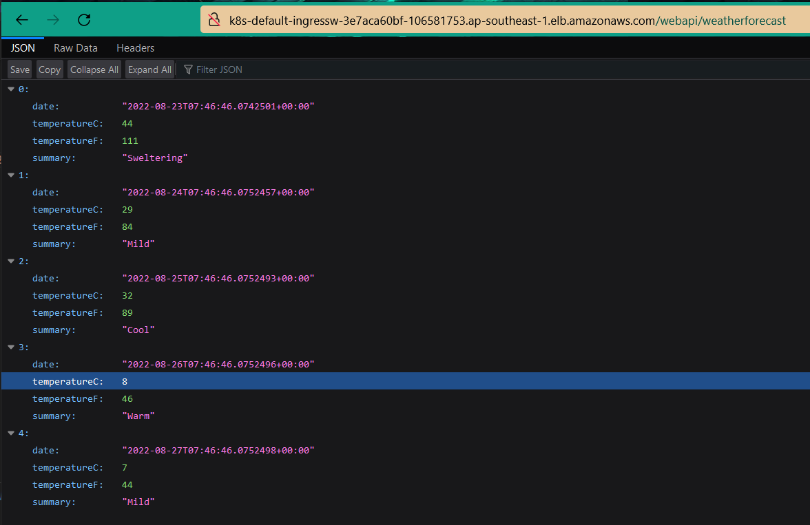

# .NET6.WebAPI to EKS using GithubActions
    Deploy a sample .NET6 WebAPI to Amazon EKS with Github Actions
    + Create Infrastructure as code using Terraform
    + Application Load Balancer in EKS

### Github Runner Requirements
+ Install Docker & DockerCompose
+ Minikube or Kubernetes cluster (see below if needed)
+ Install Amazon CLI/ eksctl
+ Install Kubectl

### Usage

+ Update kubeconfig
```
aws eks update-kubeconfig --region ap-southeast-1 --name webapi-eks
```

+ Create Role
```
aws iam create-role --role-name eksClusterRole --assume-role-policy-document file://AWS/cluster-trust-policy.json

aws iam attach-role-policy --policy-arn arn:aws:iam::aws:policy/AmazonEKSClusterPolicy --role-name eksClusterRole
```

+ oidc-provider and cluster
```
eksctl utils associate-iam-oidc-provider --region=ap-southeast-1 --cluster=webapi-eks --approve
```

+ Create policy
```
aws iam create-policy --policy-name ALBIngressControllerIAMPolicy --policy-document file://AWS/iam_policy.json
```

+ Create Role name for aws load Balancer
```
aws iam create-role --role-name AmazonEKSLoadBalancerControllerRole --assume-role-policy-document file://AWS/load-balancer-role-trust-policy.json
```

+ Attach the required Amazon EKS managed IAM policy to the IAM role
```
aws iam attach-role-policy --policy-arn arn:aws:iam::ACCOUNT_ID:policy/ALBIngressControllerIAMPolicy --role-name AmazonEKSLoadBalancerControllerRole
```

+ Create an additional policy
```
aws iam create-policy --policy-name AWSLoadBalancerControllerAdditionalIAMPolicy --policy-document file://AWS/iam_policy_v1_to_v2_additional.json
```

+ Attach Role Policy
```
aws iam attach-role-policy --role-name AmazonEKSLoadBalancerControllerRole  --policy-arn arn:aws:iam::ACCOUNT_ID:policy/AWSLoadBalancerControllerAdditionalIAMPolicy
```

+ Create Service Account
```
eksctl create iamserviceaccount --cluster=webapi-eks --namespace=kube-system --name=aws-load-balancer-controller --role-name AmazonEKSLoadBalancerControllerRole --attach-policy-arn=arn:aws:iam::ACCOUNT_ID:policy/ALBIngressControllerIAMPolicy --override-existing-serviceaccounts --approve

kubectl apply -f terraform/aws-load-balancer-controller-service-account.yml
```

+ Get IAM Service Account
```
eksctl  get iamserviceaccount --cluster webapi-eks

kubectl describe sa aws-load-balancer-controller -n kube-system

kubectl apply -k "github.com/aws/eks-charts/stable/aws-load-balancer-controller/crds?ref=master"

helm install aws-load-balancer-controller eks/aws-load-balancer-controller --set clusterName=webapi-eks --set serviceAccount.create=false --set serviceAccount.name=aws-load-balancer-controller -n kube-system
```

+ Verify that the AWS Load Balancer Controller is installed:
```
kubectl get deployment -n kube-system aws-load-balancer-controller
```

+ Get log AWS Load Balancer Controller
```
kubectl logs -n kube-system deployment.apps/aws-load-balancer-controller
```

+ Deploy Ingress EKS
```
kubectl apply -f k8s/ingress-eks.yml
```

+ Check Ingress
```
kubectl describe ingress ingress-webapi
```

### Using Terraform
+ Init Infrastructure
```
terraform init
terraform apply
```

+ Terraform will create a role name with aws-load-balancer-controller name
    + It creates a service account(aws-load-balancer-controller)
    + It sets permission
    + It sets Trust relationships(aws/load-balancer-role-trust-policy)


+ 


+ 

The same command lines below:

+ Create Service Account
```
eksctl create iamserviceaccount --cluster=webapi-eks --namespace=kube-system --name=aws-load-balancer-controller --role-name webapi-eks-lb-role-for-service-account --attach-policy-arn=arn:aws:iam::783560535431:policy/AmazonEKS_AWS_Load_Balancer_Controller-20221026035125522600000001 --override-existing-serviceaccounts --approve

kubectl apply -f terraform/aws-load-balancer-controller-service-account.yml
```

+ Get IAM Service Account
```
eksctl  get iamserviceaccount --cluster webapi-eks

kubectl describe sa aws-load-balancer-controller -n kube-system

kubectl apply -k "github.com/aws/eks-charts/stable/aws-load-balancer-controller/crds?ref=master"

helm install aws-load-balancer-controller eks/aws-load-balancer-controller --set clusterName=webapi-eks --set serviceAccount.create=false --set serviceAccount.name=aws-load-balancer-controller -n kube-system
```

+ Verify that the AWS Load Balancer Controller is installed:
```
kubectl get deployment -n kube-system aws-load-balancer-controller
```

+ Get log AWS Load Balancer Controller
```
kubectl logs -n kube-system deployment.apps/aws-load-balancer-controller
```

+ Verify that your service account is associated with the AWS Load Balancer Controller
```
kubectl get deploy aws-load-balancer-controller -n kube-system -o yaml
```

+ See what IAM role is attached to the service account associated with the AWS Load Balancer Controller:
```
kubectl describe sa aws-load-balancer-controller -n kube-system
```


### Issues
+ Couldn't create an AWS Load Balancer Controller
```
Add permission iam_policy_v1_to_v2_additional.json
```


+ Couldn't mapping to webapi service
```
Because set Path_Base in code with .NET6(Not set Path_Base variable)
```

+ The ALB couldn't call the service in EKS
```
Add Security Group and public subnets for ingress
```

### Result
+ 

+ 

+ 

+ 

### Reference
+ [An ALB Ingress in Amazon EKS](https://aws.amazon.com/premiumsupport/knowledge-center/eks-alb-ingress-aws-waf/)
+ [AWS Load Balancer Controller](https://docs.aws.amazon.com/eks/latest/userguide/aws-load-balancer-controller.html)
+ [create EKS Cluster using Terraform](https://antonputra.com/amazon/create-eks-cluster-using-terraform-modules/#deploy-cluster-autoscaler)
+ [Setting up EKS with Terraform, Helm and a Load balancer](https://andrewtarry.com/posts/terraform-eks-alb-setup/)
+ [Terraform EKS](https://learnk8s.io/terraform-eks)
